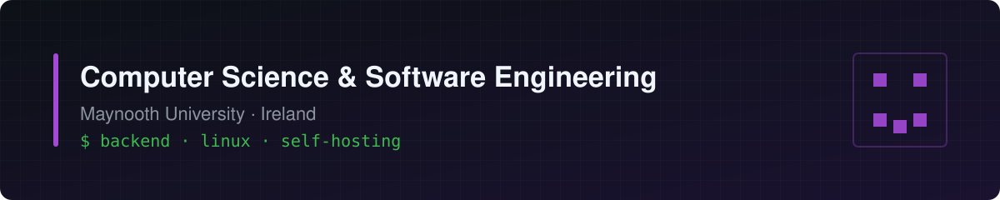

# Hi there

Student at **Maynooth University** and member of the MU CS Society.

I like building things that solve real problems, from Discord bots to self-hosted servers and backend APIs, and I enjoy the troubleshooting that comes with them.

- Currently working on **game-callout-bot**, a Discord bot for rounding up friends for game sessions
- Currently learning Arch Linux, setting it up from scratch on a dual-boot laptop
- Interested in backend development, Linux, and how software runs on hardware, including on-device AI
- Looking for a **work placement / internship** for 2027
- Achievement hunter/variety gamer in my spare time

---

## Projects

### [Placemark](https://github.com/joelx1/location-recommender) — team project
A Letterboxd-style mobile app for places: review bars, pubs and cafés, and find spots your friends recommend nearby.

I set up the backend and worked on the Spring Boot REST API, PostGIS geo-queries, friendships and activity feed, photo attachments on reviews, and proximity-based push notifications. The React Native app was built by teammates.

`Java` `Spring Boot` `PostgreSQL` `PostGIS`

### [game-callout-bot](https://github.com/JackDuffin/game-callout-bot)
A Discord bot for organising game nights: opt-in game roles, instant callouts, scheduled sessions with RSVPs and reminders, and per-game stats. Hosted on an Oracle Cloud Ubuntu server.

`Node.js` `discord.js` `SQLite` `PM2`

### [home-media-lab](https://github.com/JackDuffin/home-media-lab)
A home-lab experiment: a Jellyfin media server running on an old laptop with Ubuntu.

`Linux` `Jellyfin` `Docker`

---

## Tools I use

**Languages**

   

**Backend & databases**

    

**Infrastructure & tools**

    

---

## Get in touch

